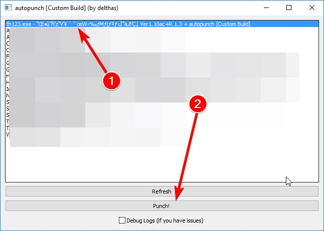

# autopunch  

**This program lets you host & connect to friends to play peer-to-peer games without having to open or redirect any port. This does not add any latency to the connection compared to redirecting ports manually.**

**You can play with users that don't use autopunch without compability issues and can always leave it enabled. However, the tool will only do its magic if both peers use autopunch.**

*Technical details: autopunch injects itself into a process and detours some winsock calls (sendto, recvfrom, ...) to rewrite addresses so that they appear to be internal ports rather than external ports. It additionally performs hole punching by using a STUN-like relay which helps know internal ports of other users.*  

## How to use

- **Download the latest version: for [Windows 64 bits](https://github.com/delthas/autopunch/releases/latest/download/autopunch.win64.exe) or [Windows 
32 bits](https://github.com/delthas/autopunch/releases/latest/download/autopunch.win32.exe)**
- **Start your peer-to-peer game** *(for Touhou Hisoutensoku players: also run SokuRoll now, if needed)*
- **Double-click the downloaded executable file to run it**; there is no setup or anything so put the file somewhere you'll remember (doesn't have to be in the game folder)
- If a Windows Defender SmartScreen popup appears, click on "More information", then click on "Run anyway"
- If a Windows Firewall popup appears, check the "Private networks" and "Public networks" checkboxes, then click on "Allow access"
- If prompted for an update, just wait, everything will be updated and restart automatically
- **Click on the game you wish to play in the list, then click "Punch!"**; the window will close and "autopunch" will appear in the game window title *(just like SokuRoll)*
- **Play!** Host on any port, or connect to the IP and port the host gives you just as usual.
- You can host and connect to peer with or without using autopunch: no compatibility issues, you can always leave it running.
- **However, if a host didn't forward its ports, both peers will need autopunch, not just the one hosting!**

### Troubleshooting

- If you experience any issue when using autopunch, make sure that both peers are running autopunch. *For Hisoutensoku players: if using SokuRoll, run it before running the tool.*
- For some very rare users having a very old or cheap Internet router, or playing at a work office, autopunch might just not work *when they are hosting*. Try switching who hosts if this happens.
- If you have any other issue or feedback, either contact me on Discord at `cc#6439` or [open an issue on Github](https://github.com/delthas/autopunch/issues/new). **When doing that, please check the Debug checkbox, punch and play again, close the game and send me the log file.**

## Advanced usage

- No command-line flags, no advanced usage. If you need anything specific open an issue or ask me.
